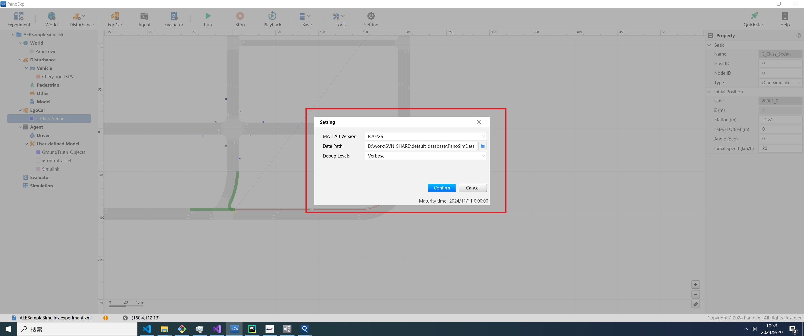
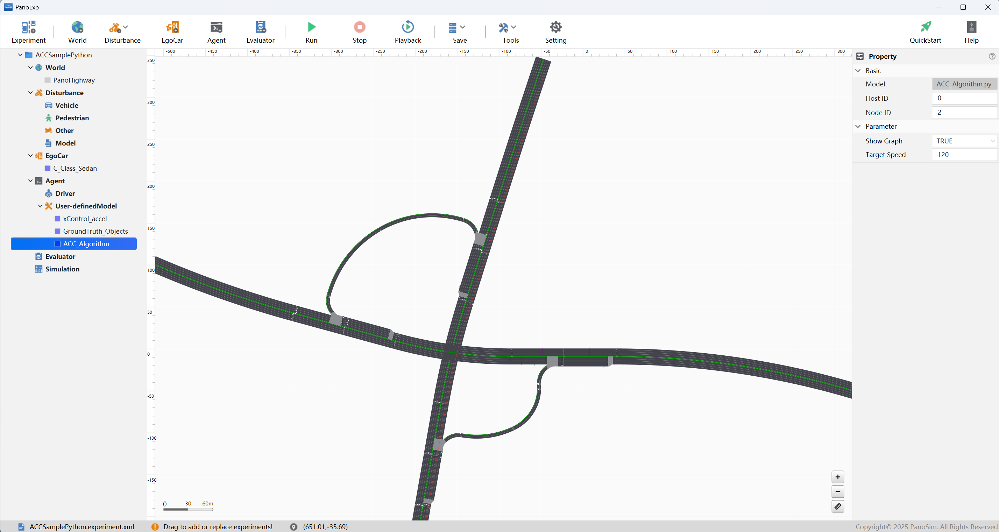
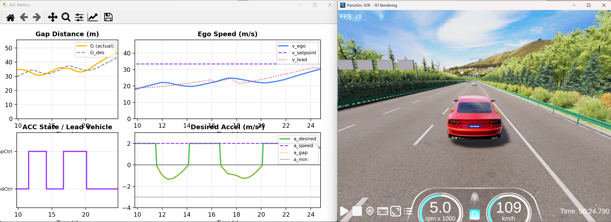

# PanoSim Algorithm ACC_Python：ACC Python Sample算法

## 1. 安装部署

### 1.1 下载[文件](./PanoSimDatabase)

### 1.2 查询本地对应目录

### 1.3 复制文件到本地对应目录

## 2. 运行实验

## 3. ACC Sample Python

### 3.1 Python 源代码
[%PanoSimDatabaseHome%/Plugin/Agent/ACC_Algorithm.py](PanoSimDatabase/Plugin/Agent/ACC_Algorithm.py)

### 3.2 可视化运行

## 4. 引用
### [1] [Matlab ACC Sample](https://ww2.mathworks.cn/help/releases/R2022a/driving/ug/adaptive-cruise-control-with-sensor-fusion.html)