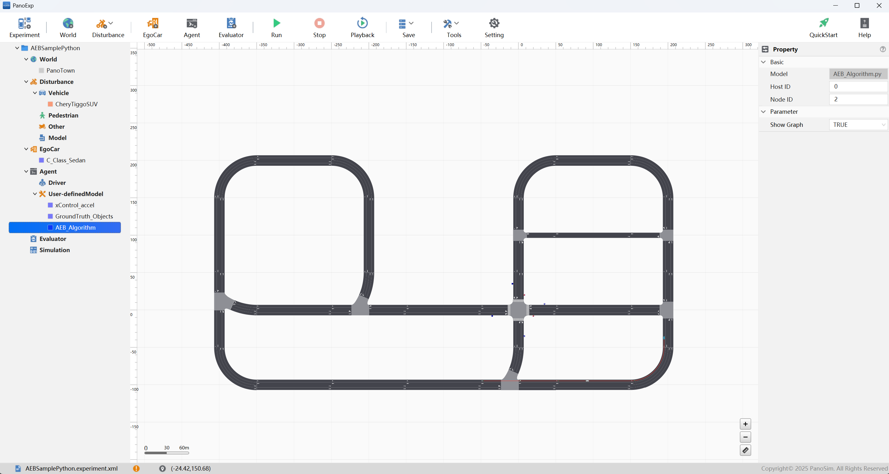
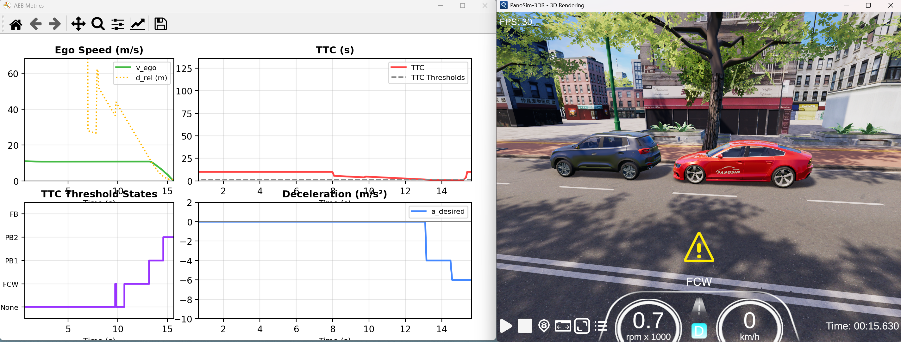

# PanoSim Algorithm AEB_Python：AEB Python Sample算法

## 1. 安装部署

### 1.1 下载[文件](./PanoSimDatabase)

### 1.2 查询本地对应目录

### 1.3 复制文件到本地对应目录

## 2. 运行实验

## 3. AEB Sample Python

### 3.1 Python 源代码
[%PanoSimDatabaseHome%/Plugin/Agent/AEB_Algorithm.py](PanoSimDatabase/Plugin/Agent/AEB_Algorithm.py)

### 3.2 可视化运行

## 4. 引用
### [1] [Matlab AEB Sample](https://ww2.mathworks.cn/help/releases/R2022a/driving/ug/autonomous-emergency-braking-with-sensor-fusion.html?searchHighlight=aeb&s_tid=doc_srchtitle)
### [2] Hulshof, Wesley, Iain Knight, Alix Edwards, Matthew Avery, and Colin Grover. "Autonomous Emergency Braking Test Results." In Proceedings of the 23rd International Technical Conference on the Enhanced Safety of Vehicles (ESV) , Paper Number 13-0168. Seoul, Korea: ESV Conference, 2013.
### [3] European New Car Assessment Programme (Euro NCAP). Test Protocol – _AEB Systems . Version 2.0.1. Euro NCAP, November, 2017.
### [4] European New Car Assessment Programme (Euro NCAP). Test Protocol – AEB VRU Systems. Version 2.0.2. Euro NCAP, November, 2017.