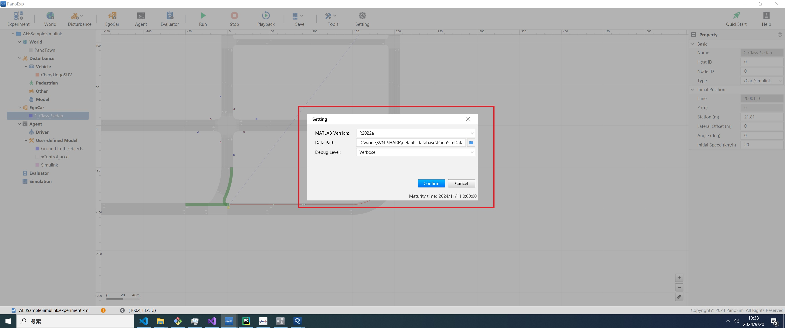
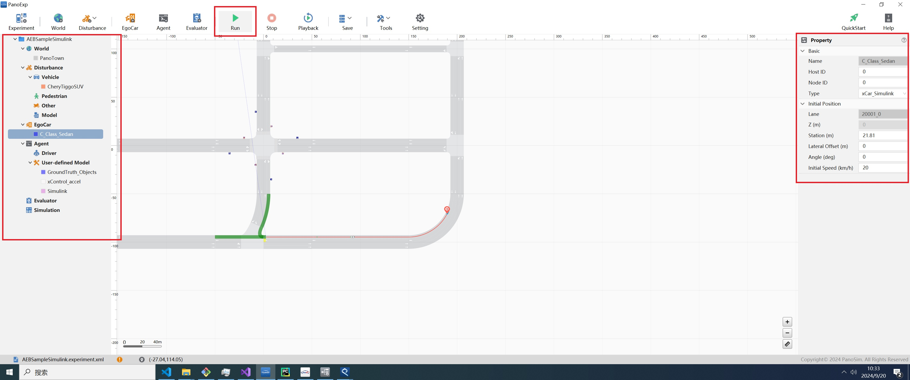
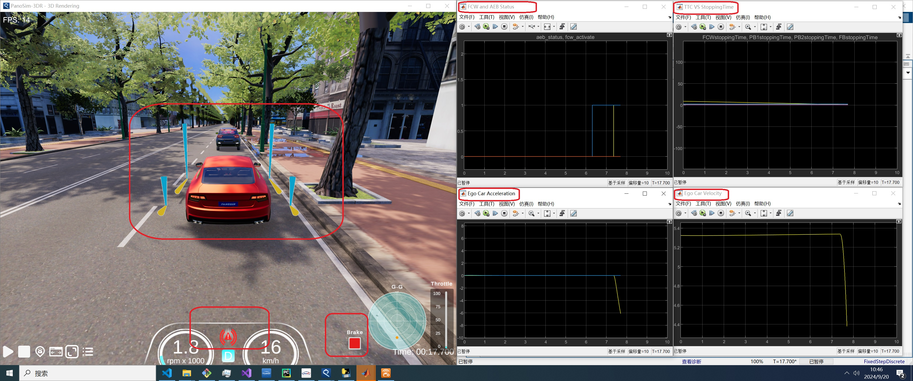

# PanoSim Algorithm AEB_Simulink：AEB Simulink Sample算法

## 1. 安装部署

### 1.1 下载[文件](https://github.com/liyanlee/PanoSim_How_To/tree/main/Algorithm/AEB/AEB_Simulink/PanoSimDatabase)
### 此Sample运行需要安装matlab2022a版本，请预先安装

### 1.2 查询本地对应目录

### 1.3 复制文件到本地对应目录

## 2. 运行实验

## 3. AEB Sample Simulink

### 3.1 Simulink 源代码
[%PanoSimDatabaseHome%/Experiment/AEBSampleSimulink/Temp/AEBSampleSimulink.mdl](PanoSimDatabase\Experiment\AEBSampleSimulink\Temp\AEBSampleSimulink.mdl)

### 3.2 可视化运行

