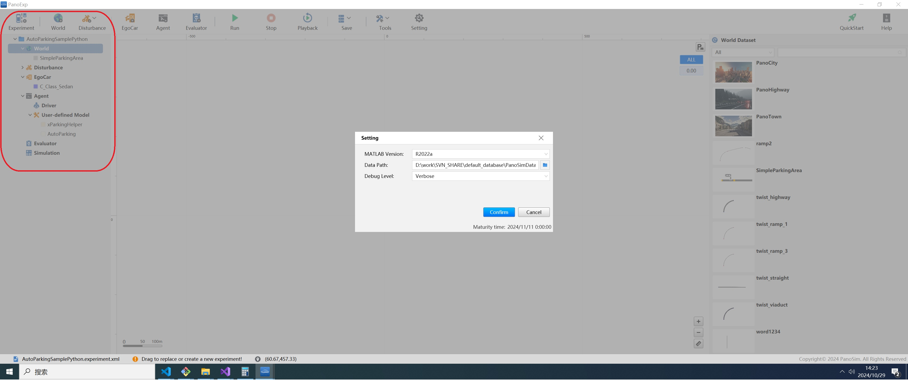
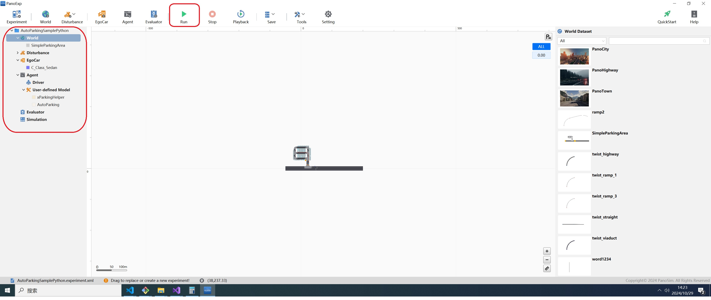
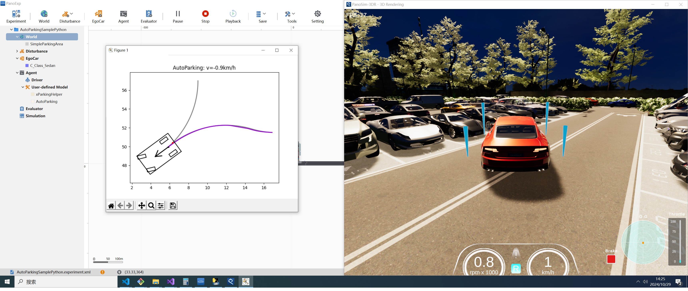

# PanoSim Algorithm APA_Python：AutoParking Python Sample算法

## 1. 安装部署

### 1.1 下载[文件](./PanoSimDatabase)

### 1.2 查询本地对应目录

### 1.3 复制文件到本地对应目录

## 2. 运行实验

## 3. AutoParking Sample Python

### 3.1 Python 源代码
[%PanoSimDatabaseHome%/Plugin/Agent/AutoParking.py](PanoSimDatabase/Plugin/Agent/AutoParking.py)

### 3.2 可视化运行

## 4. 引用
### [1] https://zhuanlan.zhihu.com/p/596632865
### [2] https://blog.csdn.net/WaiNgai1999/article/details/132062188
### [3] https://github.com/zhm-real/MotionPlanning/tree/master
