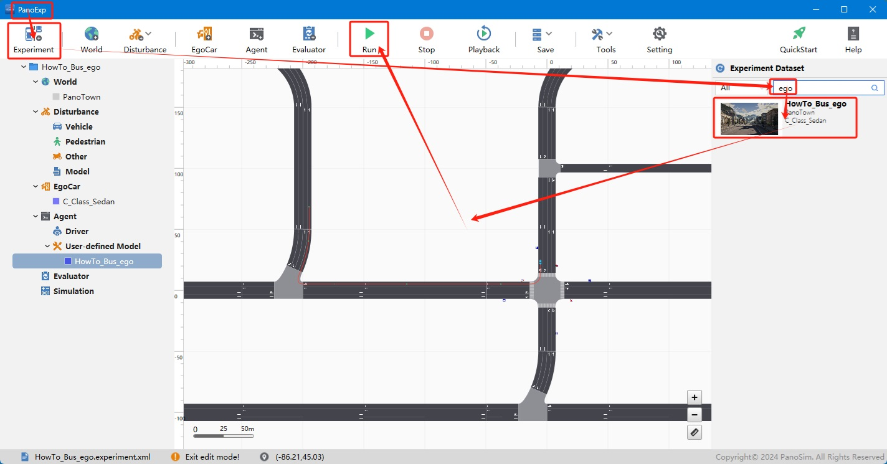
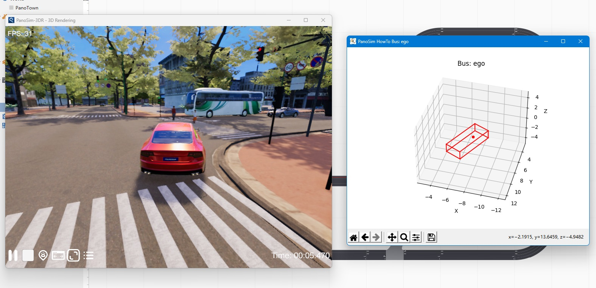

# PanoSim ego总线

## 1. 安装部署

### 1.1 下载[文件](https://github.com/liyanlee/PanoSim_How_To/tree/main/Bus/ego/PanoSimDatabase)

### 1.2 复制文件到本地对应目录
 - 查询本地对应目录
```
echo %PanoSimDatabaseHome%
```

## 2. 运行实验



## 3. IMU传感器数据可视化

### 3.1 可视化实现源码
[%PanoSimDatabaseHome%/Plugin/Agent/HowTo_Bus_ego.py](PanoSimDatabase/Plugin/Agent/HowTo_Bus_ego.py)

### 3.2 可视化运行

