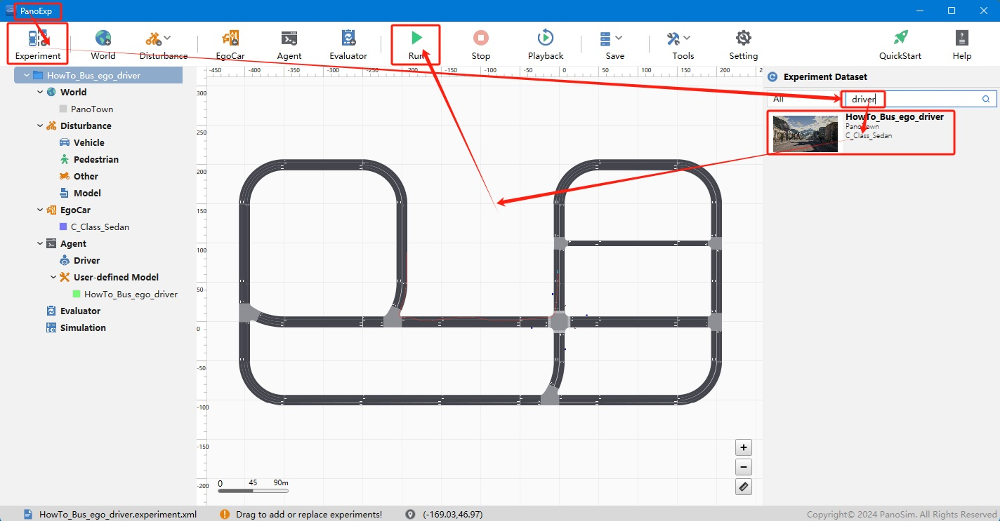

# PanoSim ego_driver总线：获取主车信号(油门、刹车、方向盘等)

## 1. 安装部署

### 1.1 下载[文件](https://github.com/liyanlee/PanoSim_How_To/tree/main/Bus/ego_driver/PanoSimDatabase)

### 1.2 查询本地对应目录

### 1.3 复制文件到本地对应目录

## 2. 运行实验

## 3. ego_driver总线数据可视化

### 3.1 可视化实现源码
[%PanoSimDatabaseHome%/Plugin/Agent/HowTo_Bus_ego_driver.py](PanoSimDatabase/Plugin/Agent/HowTo_Bus_ego_driver.py)

### 3.2 可视化运行

