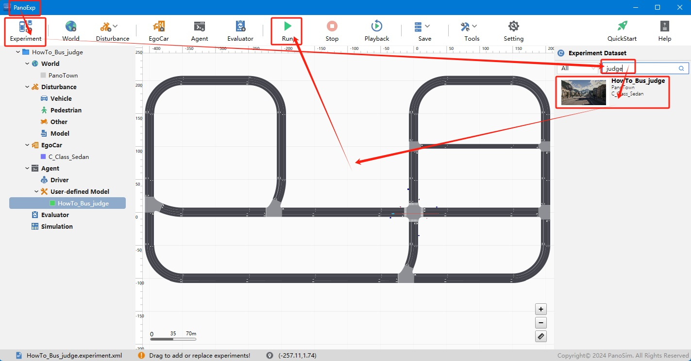
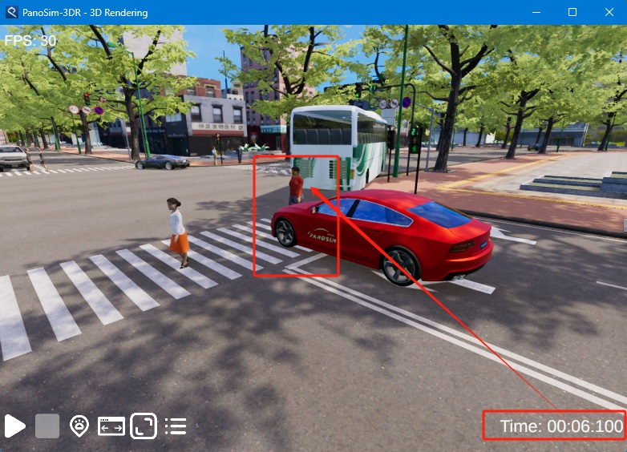
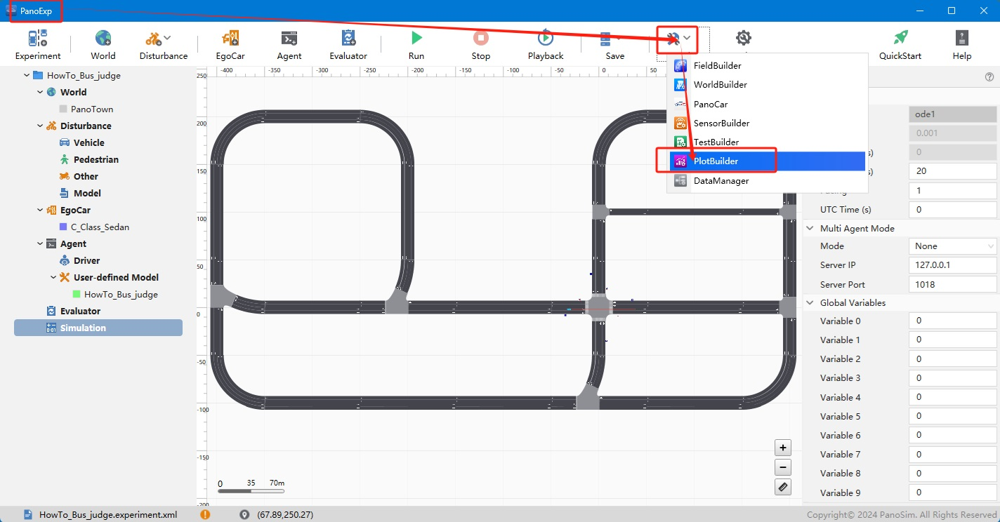
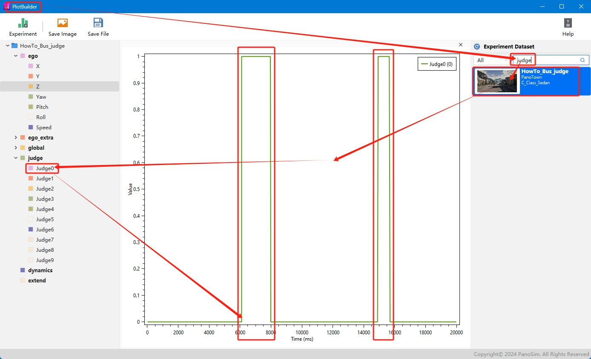

# PanoSim judge总线

## 1. 安装部署

### 1.1 下载[文件](https://github.com/liyanlee/PanoSim_How_To/tree/main/Bus/judge/PanoSimDatabase)

### 1.2 查询本地对应目录

### 1.3 复制文件到本地对应目录

## 2. 运行实验

## 3. judge总线数据可视化

### 3.1 可视化实现源码
[%PanoSimDatabaseHome%/Plugin/Agent/HowTo_Bus_judge.py](PanoSimDatabase/Plugin/Agent/HowTo_Bus_judge.py)

### 3.2 实验运行时, 修改judge总线

### 3.3 实验结束后, 打开PlotBuilder, 查看judge总线

