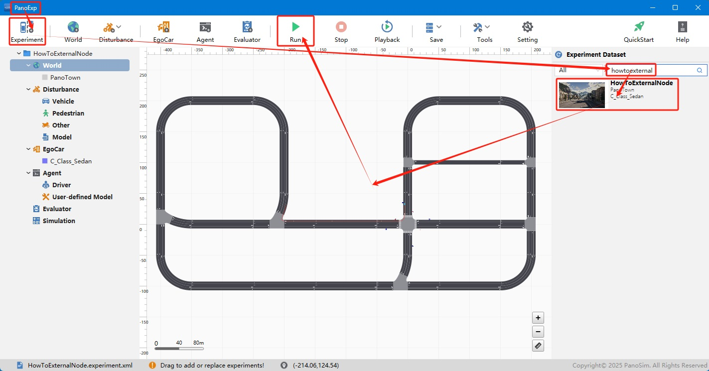
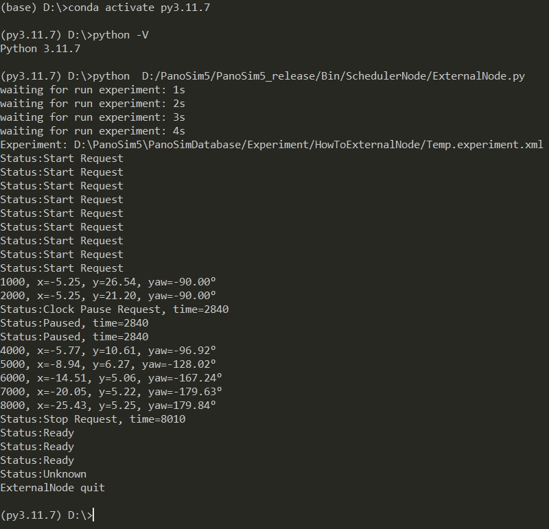

# PanoSim 外部调度器

## 1. 概述

PanoSim5内置了python运行环境({PanoSim安装目录}/Bin/py36), 目前内置的python环境版本(3.6)是固定的, 不能修改。
考虑到在不同应用场景中, 会使用到不同版本的python运行环境。
本实例提出了一种方法, 使用任意python环境, 在仿真运行时, 实现与PanoSim互操作。

## 2. 安装部署

### 2.1 下载外部调度器[ExternalNode.py](ExternalNode.py), 保存到本地任意路径

例如: D:/PanoSim5_v33/PanoSim5_release/Bin/SchedulerNode/

### 2.2 下载[实验文件](./PanoSimDatabase)

> [!NOTE]
> 可以使用任意实验运行外部调度器。
> 这里的下载操作仅用于后续的说明。

### 2.3 查询本地对应目录


### 2.4 复制文件到本地对应目录

### 2.5 重新启动PanoExp

## 3. 运行

### 3.1 运行调度器

```shell
conda activate py3.11.7
python D:/PanoSim5_v33/PanoSim5_release/Bin/SchedulerNode/ExternalNode.py
```

### 3.2 运行实验




## 4. 运行结果

1. 进入外部python环境, python版本为:3.11.7
2. 运行调度器
3. 调度器等待(默认最大等待30秒, 可以在[ExternalNode.py](ExternalNode.py)中修改)PanoSim仿真实验运行
4. 检测到PanoSim仿真实验启动, 输出本次仿真使用的实验文件
5. 根据**状态**变化, 等待实验启动完成
6. 实验运行后, 每隔1秒, 输出主车简单位姿信息
7. 在Unity3D窗口暂定实验运行, **状态**变化为"Paused"
8. 在Unity3D窗口恢复实验运行, 继续输出主车简单位姿信息
9. 在Unity3D窗口停止实验运行, **状态**变化为"Stop"
10. 关闭Unity3D窗口退出使用运行, **状态**变化为"Unknown"
11. 外部调度器退出运行

外部调度器的运行结果如下图所示: 


