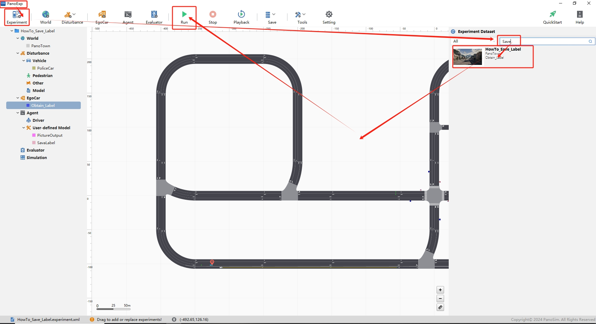
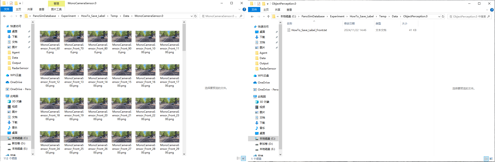

# PanoSim 定制插件——传感器——自动化标注

## 1. 安装部署

### 1.1 下载[文件](./PanoSimDatabase)

### 1.2 查询本地对应目录

### 1.3 复制文件到本地对应目录

### 1.4 重新启动PanoExp

## 2. 运行实验

## 3. 自动化保存图片和标注文件

### 3.1 保存图片源码
[%PanoSimDatabaseHome%/Plugin/Agent/PictureOutput.py](PanoSimDatabase/Plugin/Agent/PictureOutput.py)

### 3.2 保存标注的二进制文本文件源码
[%PanoSimDatabaseHome%/Plugin/Agent/SavaLabel.py](PanoSimDatabase/Plugin/Agent/SavaLabel.py)

### 3.3 保存的图片和文本文件目录

### 3.4 将二进制文本文件保存为COCO格式的JSON文件源码
[%PanoSimDatabaseHome%/Plugin/Agent/To_COCO.py](PanoSimDatabase/Plugin/Agent/To_COCO.py)

### 3.5 标注可视化效果
