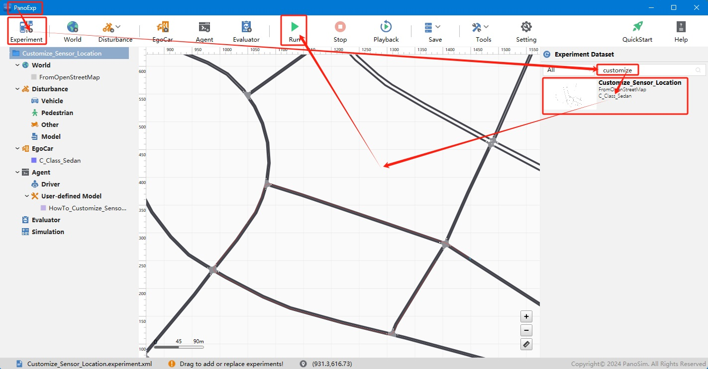
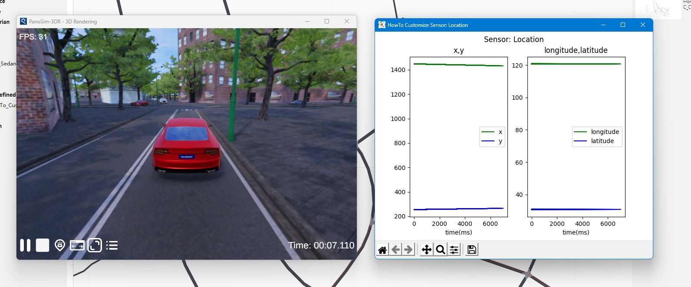

# PanoSim 定制插件——传感器——定位器

## 1. 获取地图并导入(可选)
### 1.1 获取地图文件
例如: 从[www.openstreetmap.org](https://www.openstreetmap.org)下载地图文件[%PanoSimDatabase%/World/FromOpenStreetMap.osm](PanoSimDatabase/World/FromOpenStreetMap.osm)

### 1.2 导入地图文件

## 2. 安装部署

### 2.1 下载[文件](./PanoSimDatabase)

### 2.2 查询本地对应目录

### 2.3 复制文件到本地对应目录

## 3. 运行实验

## 4. 定位器的实现与可视化

### 4.1 实现与可视化源码
[%PanoSimDatabaseHome%/Plugin/Agent/HowTo_Customize_Sensor_Location.py](PanoSimDatabase/Plugin/Agent/HowTo_Customize_Sensor_Location.py)

### 4.2 可视化
