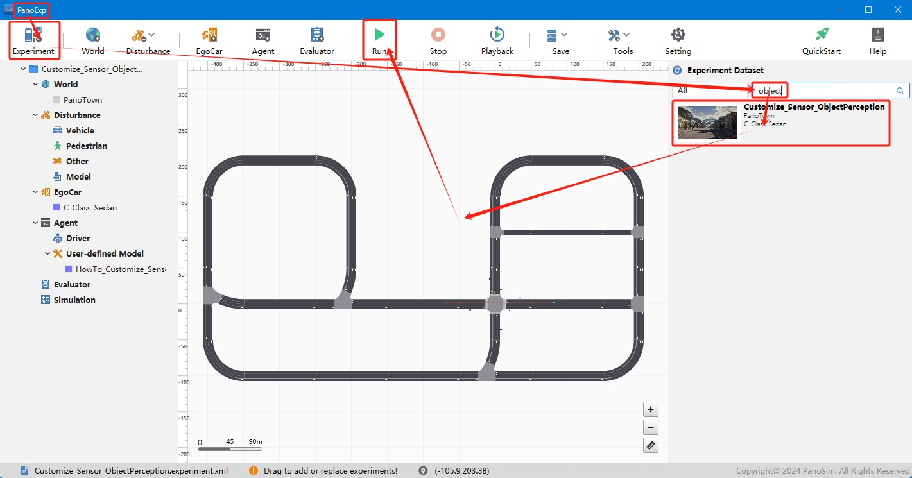
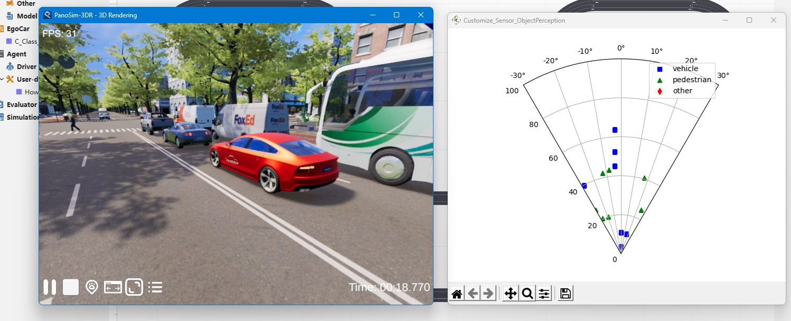

# PanoSim 定制插件——传感器——目标感知器

## 1. 安装部署

### 1.1 下载[文件](./PanoSimDatabase)

### 1.2 查询本地对应目录

### 1.3 复制文件到本地对应目录

## 2. 运行实验

## 3. 目标感知器的实现与可视化

### 3.1 实现与可视化源码
[%PanoSimDatabaseHome%/Plugin/Agent/HowTo_Customize_Sensor_ObjectPerception.py](PanoSimDatabase/Plugin/Agent/HowTo_Customize_Sensor_ObjectPerception.py)

### 3.2 可视化
