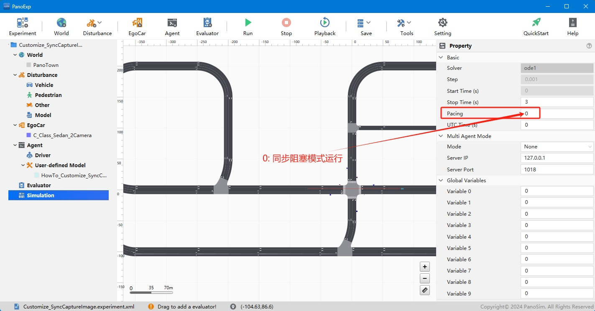
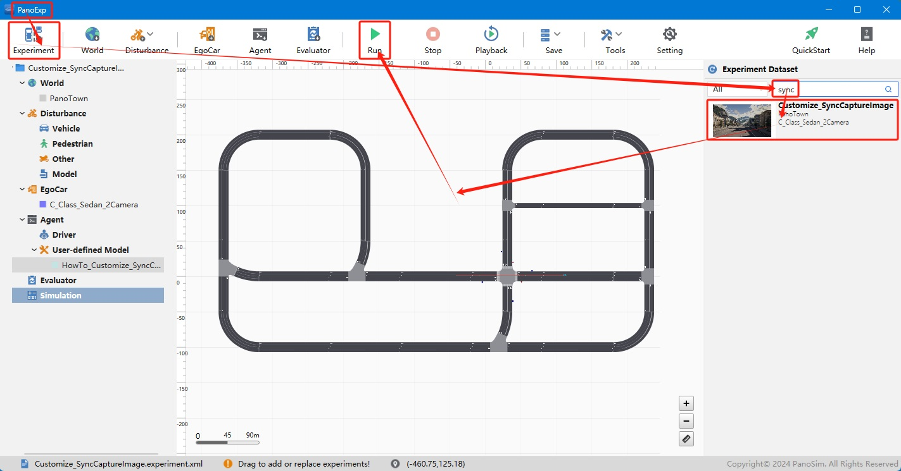
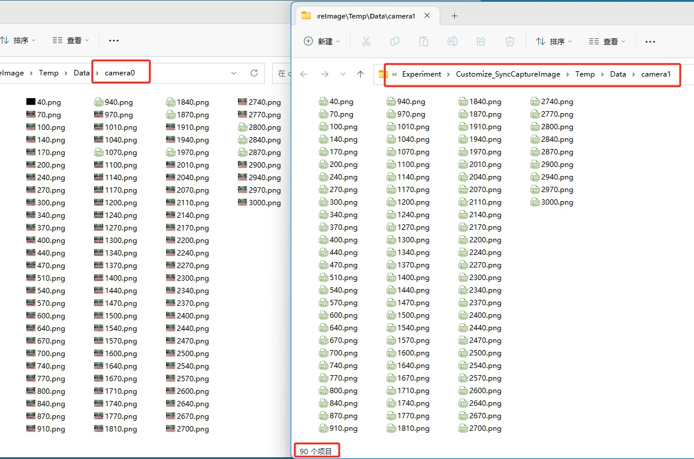

# PanoSim 定制插件——同步保存图像

## 1. 概述
PanoSim通常运行在**实时模式**(`Pacing:1`)，即：在约定时间内必须执行完成，否则就会异常。

本示例中，主车安装了2个单目相机传感器，分辨率都为320*240, FPS都为30，即：每个相机每秒输出30次。需要在仿真运行时，同步保存这两个相机的输出(png)。

在**实时模式**运行实验时，由于保存执行速度较慢，不能保证在约定时间(每秒保存30*2次)完成，出现数据丢失。

针对这种应用场景，PanoSim提供了**同步阻塞模式**(`Pacing:0`)，保证数据的正确和完整。设置方法如下图所示:

## 2. 安装部署

### 2.1 下载[文件](./PanoSimDatabase)

### 2.2 查询本地对应目录

### 2.3 复制文件到本地对应目录

### 2.4 重新启动PanoExp

## 3. 运行实验

## 4. 同步保存图像实现源码
[%PanoSimDatabaseHome%/Plugin/Agent/HowTo_Customize_SyncCaptureImage.py](PanoSimDatabase/Plugin/Agent/HowTo_Customize_SyncCaptureImage.py)

## 5. 运行结果
仿真运行3秒后，自动停止运行。在实验目录，可以查看两个相机分别输出的90张图片

