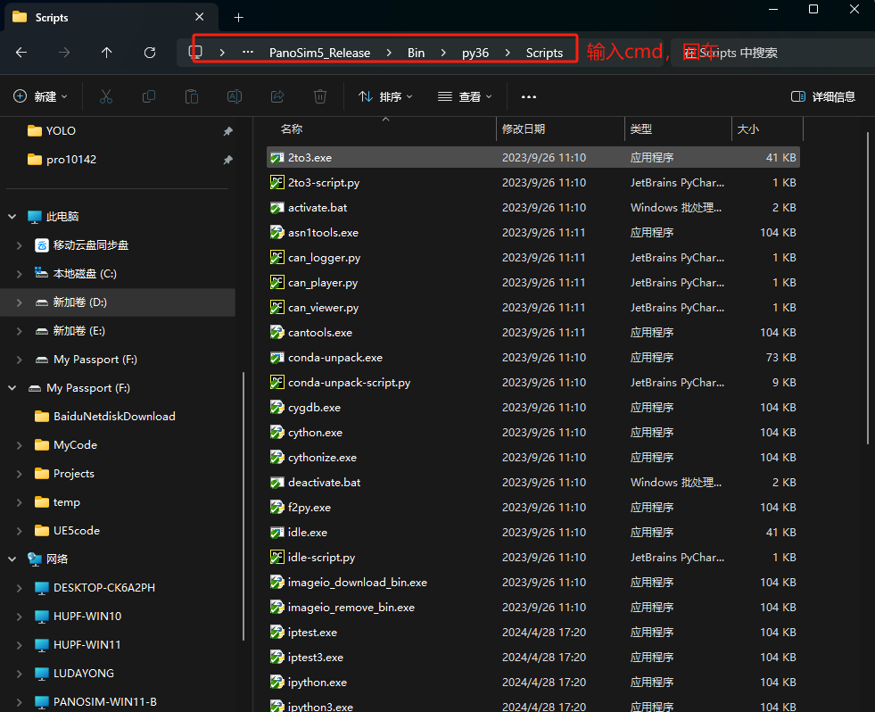
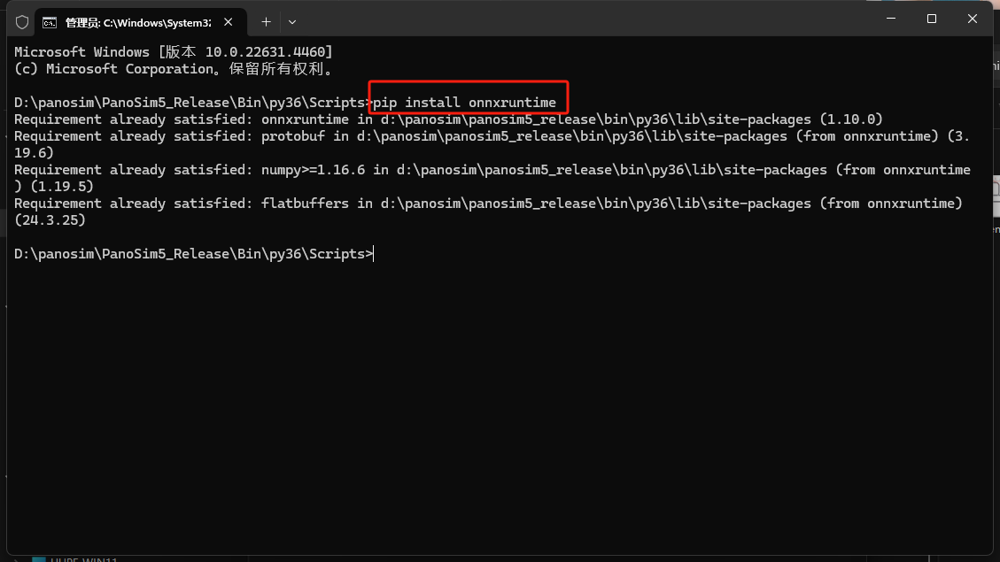
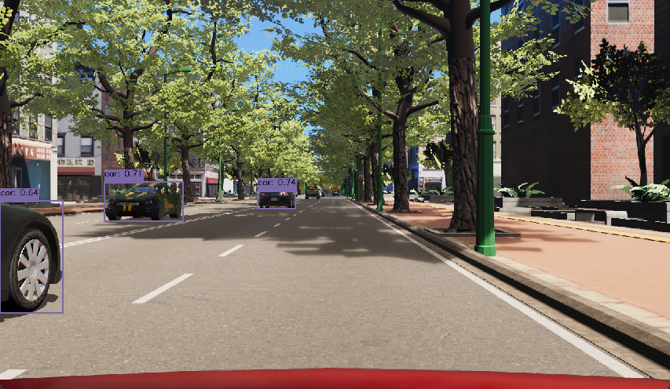

# PanoSim 定制插件——YOLO
## 1. 概述
在PanoSim Agent中实时调用YOLO v8物体识别分类模型，输出预测结果的可视化。

在PanoSim自带Python下需要安装onnxruntime包。
在PanoSim Python 路径下打开命令行

使用pip安装onnxruntime

如果想要使用自己训练的YOLO模型，可以参考[文件](export2onnx.py)，将文件转为py36可运行的onnx模型。

## 2. 安装部署

### 2.1 下载[文件](./PanoSimDatabase)

### 2.2 查询本地对应目录

### 2.3 复制文件到本地对应目录

### 2.4 重新启动PanoExp

## 3. 运行实验

## 4. 同步保存图像实现源码
[%PanoSimDatabaseHome%/Plugin/Agent/YOLOtest.py](PanoSimDatabase/Plugin/Agent/YOLOtest.py)

## 5. 运行结果
仿真运行可见独立弹窗结果

