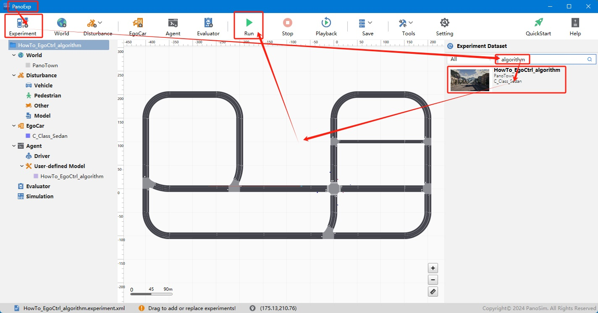
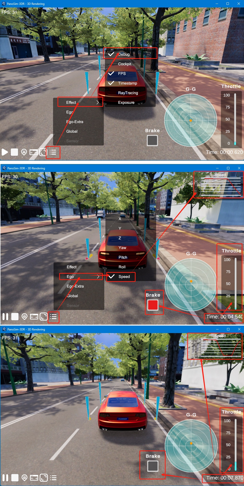

# PanoSim 主车控制——算法

## 1. 安装部署

### 1.1 下载[文件](https://github.com/liyanlee/PanoSim_How_To/tree/main/EgoControl/algorithm/PanoSimDatabase)

### 1.2 查询本地对应目录

### 1.3 复制文件到本地对应目录

## 2. 运行实验

## 3. 主车控制

### 3.1 实现源码
[%PanoSimDatabaseHome%/Plugin/Agent/HowTo_EgoCtrl_algorithm.py](PanoSimDatabase/Plugin/Agent/HowTo_EgoCtrl_algorithm.py)

### 3.2 可视化
