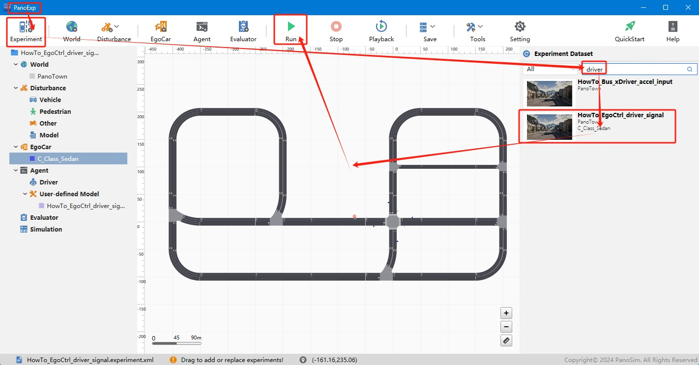

# PanoSim 主车控制信号——驾驶员控制信号

## 1. 安装部署

### 1.1 下载[文件](./PanoSimDatabase)

### 1.2 查询本地对应目录

### 1.3 复制文件到本地对应目录

## 2. 运行实验

## 3. 主车控制信号

### 3.1 实现源码
[%PanoSimDatabaseHome%/Plugin/Agent/HowTo_EgoCtrl_driver_signal.py](PanoSimDatabase/Plugin/Agent/HowTo_EgoCtrl_driver_signal.py)

### 3.2 操作方法
使用键盘控制主车行驶, 按键如下表所示

| Press Key | Signal             |
|-----------|--------------------|
| Page Up   | mode      =   6    |
| Page Down | mode      =   -1   |
| Up        | throttle  =   0.3  |
| Down      | brake     =   5    |
| Left      | steer     =   180  |
| Right     | steer     =   -180 |
