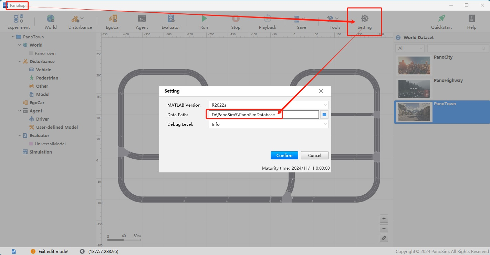
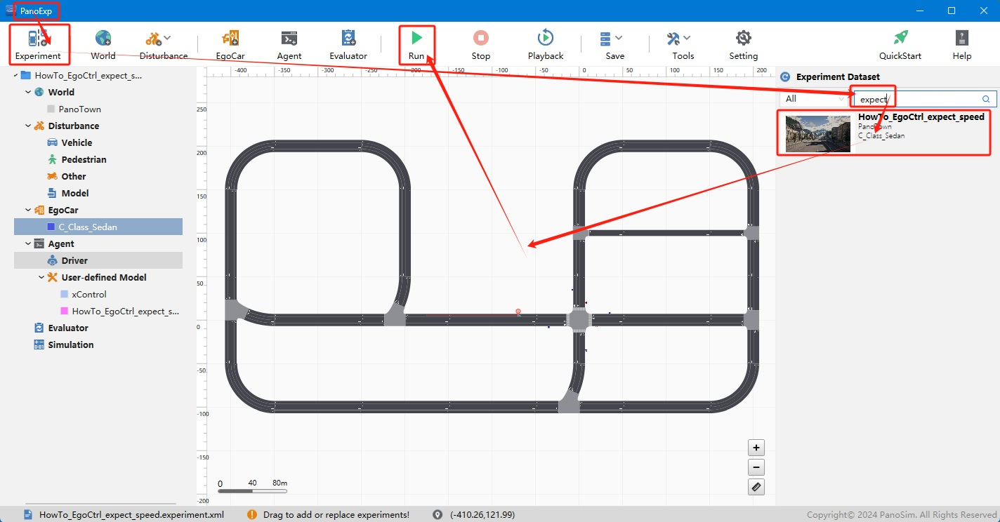
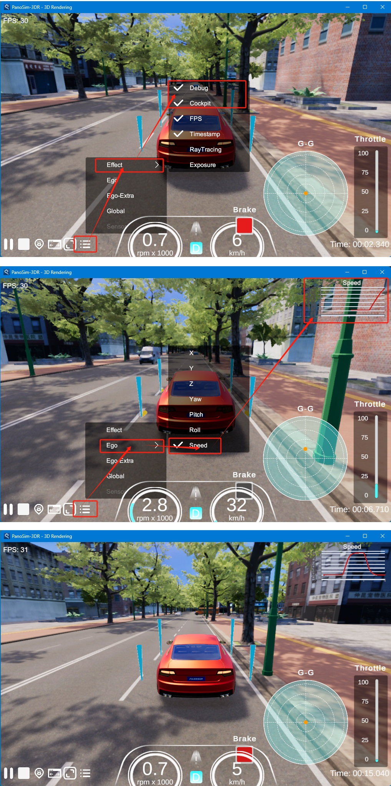

# PanoSim 主车纵向移动控制信号——期望速度控制信号

## 1. 安装部署

### 1.1 下载[文件](./PanoSimDatabase)

### 1.2 查询本地对应目录

### 1.3 复制文件到本地对应目录

## 2. 运行实验

## 3. 期望速度控制信号

### 3.1 实现源码
[%PanoSimDatabaseHome%/Plugin/Agent/HowTo_EgoCtrl_expect_speed.py](PanoSimDatabase/Plugin/Agent/HowTo_EgoCtrl_expect_speed.py)

### 3.2 可视化
通过仿真实验运行时设置期望速度控制主车纵向移动

