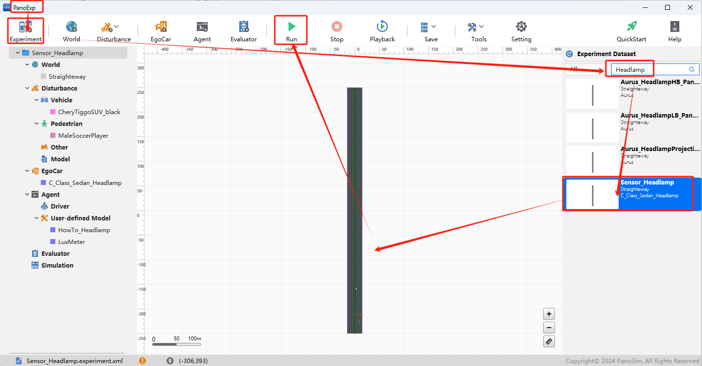
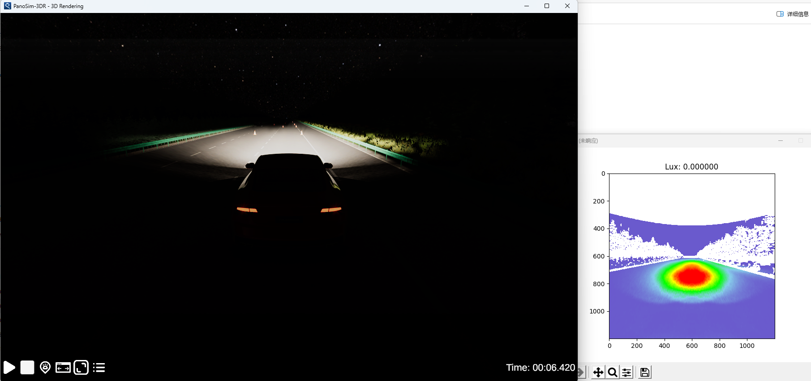
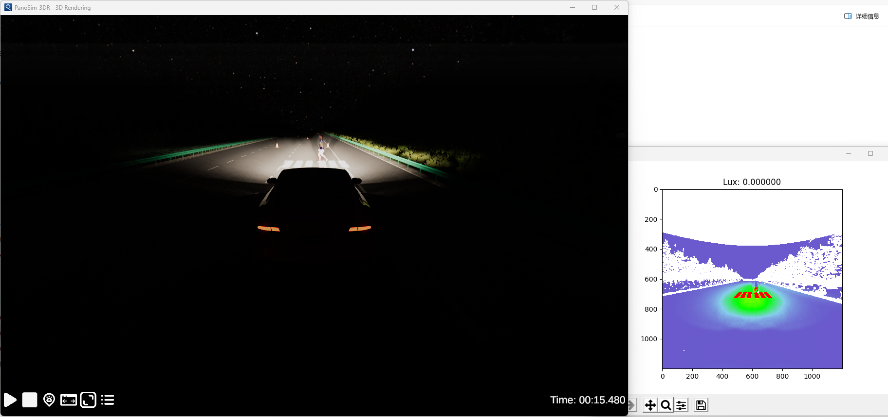
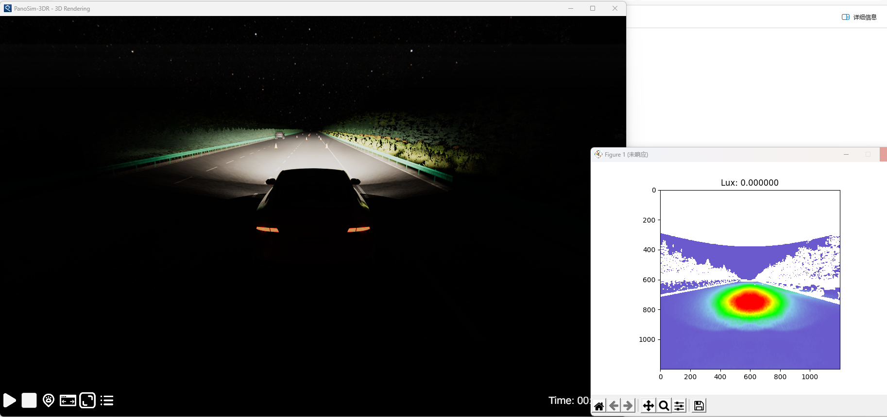
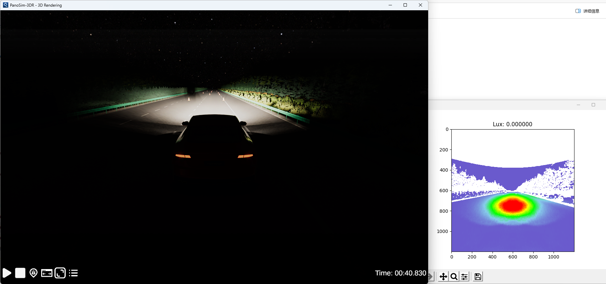

# PanoSim Headlamp

## 1. 安装部署

### 1.1 下载[文件](./PanoSimDatabase)

### 1.2 查询本地对应目录

### 1.3 复制文件到本地对应目录

### 1.4 重新启动PanoExp

## 2. 运行实验

## 3. Headlamp可视化

### 3.1 可视化实现源码
[%PanoSimDatabaseHome%/Plugin/Agent/HowTo_Head.py](PanoSimDatabase/Plugin/Agent/HowTo_Headlamp.py)

### 3.2 可视化运行

