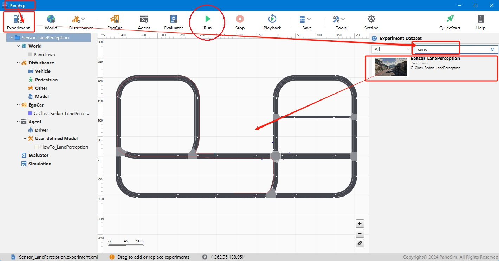
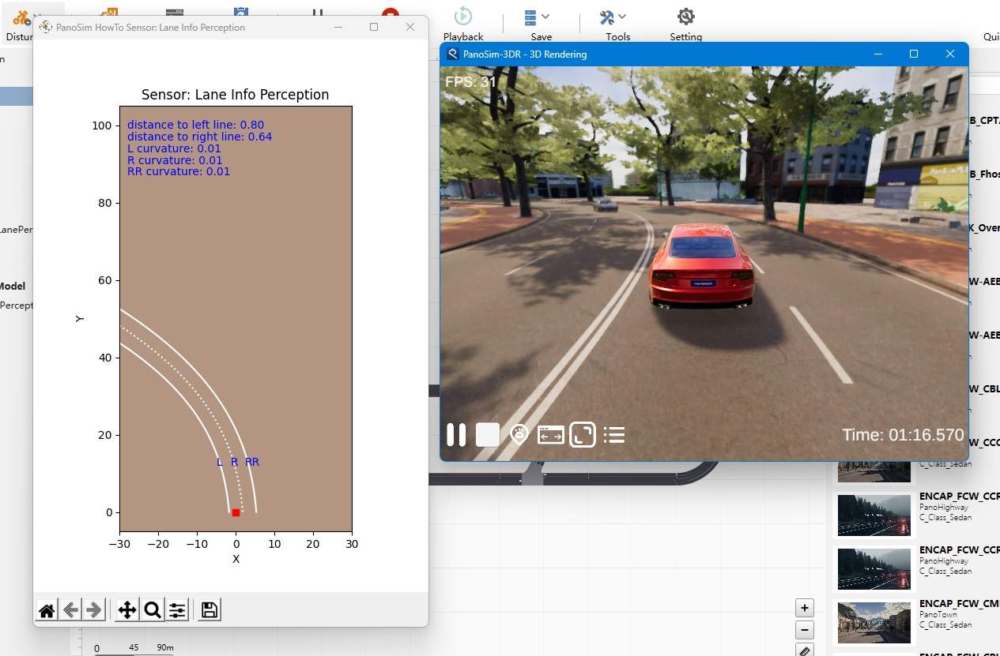

# PanoSim 车道线传感器

## 1. 安装部署

### 1.1 下载[文件](https://github.com/liyanlee/PanoSim_How_To/tree/main/Sensor/Perception/LaneInfoPerception/PanoSimDatabase)

### 1.2 复制文件到本地对应目录
 - 查询本地对应目录
```
echo %PanoSimDatabaseHome%
```

## 2. 运行实验



## 3. 车道线传感器数据可视化

