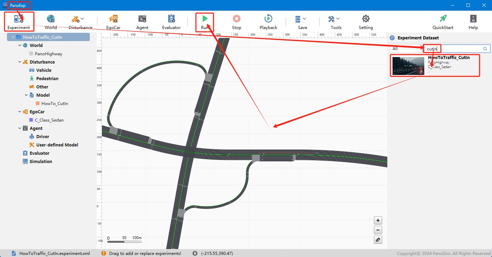
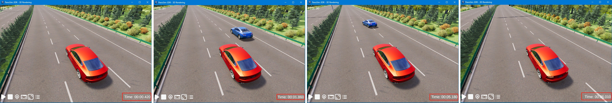

# PanoSim 交通——CutIn

## 1. 简介
    (1) 主车行驶1秒后，在主车右侧车道前方5米创建干扰车(CutIn)
    (2) 干扰车与主车用相同速度行驶2秒后, 干扰车向左侧变道
    (3) 干扰车完成变道后, 与主车用相同速度继续行驶
    (4) 当主车到达目的地(速度小于阈值), 删除干扰车

## 2. 安装部署

### 2.1 下载[文件](./PanoSimDatabase)

### 2.2 查询本地对应目录

### 2.3 复制文件到本地对应目录

### 2.4 重新启动PanoExp

## 3. 运行实验

## 4. 实现与可视化

### 4.1 实现源码
[%PanoSimDatabaseHome%/Plugin/Disturbance/HowTo_CutIn.py](PanoSimDatabase/Plugin/Disturbance/HowTo_CutIn.py)

### 4.2 可视化

