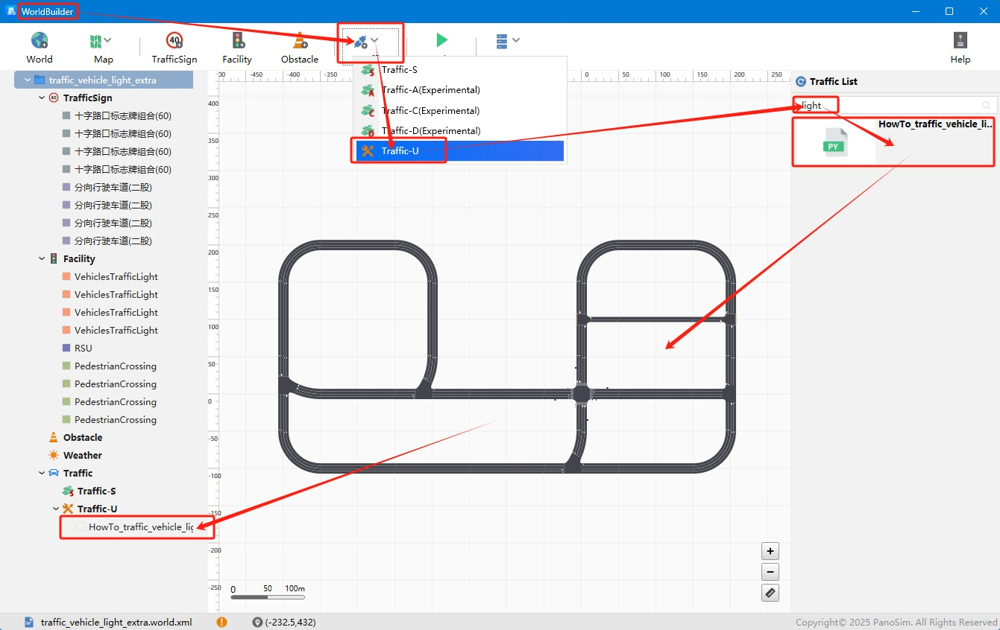
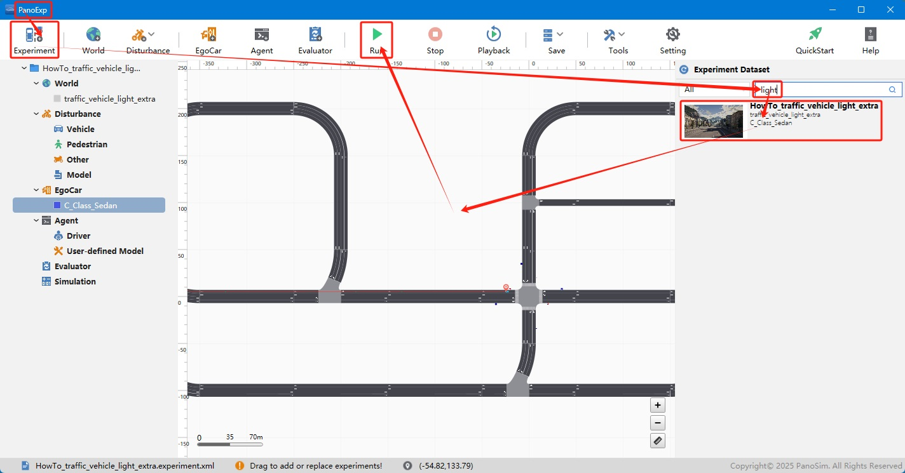
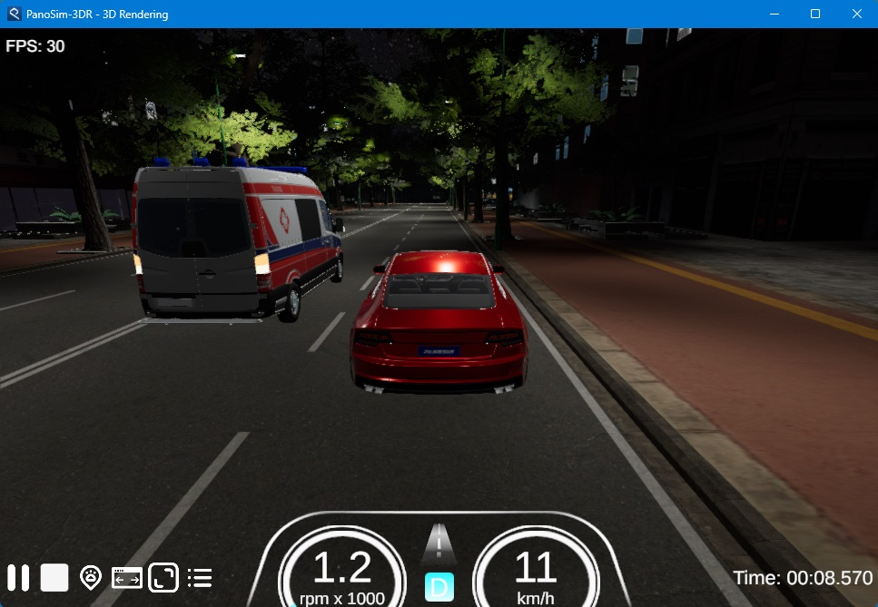

# PanoSim 交通——车灯

## 1. 简介
此实例介绍使用**Traffic**插件实现交通车灯光控制。

*Traffic*插件需要使用**WorldBuilder**安装，如下图所示：

## 2. 安装部署

### 2.1 下载[文件](./PanoSimDatabase)

### 2.2 查询本地对应目录

### 2.3 复制文件到本地对应目录

### 2.4 重新启动PanoExp

## 3. 运行实验

## 4. 实现与可视化

### 4.1 实现源码
[%PanoSimDatabaseHome%/Plugin/Traffic/HowTo_traffic_vehicle_light_extra.py](PanoSimDatabase/Plugin/Traffic/HowTo_traffic_vehicle_light_extra.py)

### 4.2 可视化

