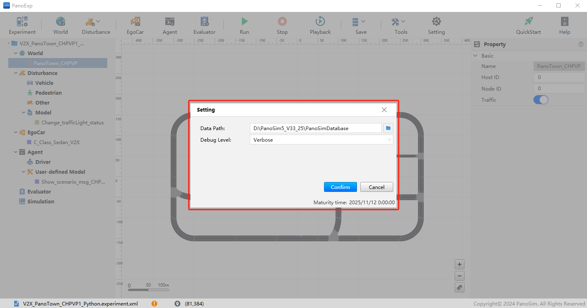
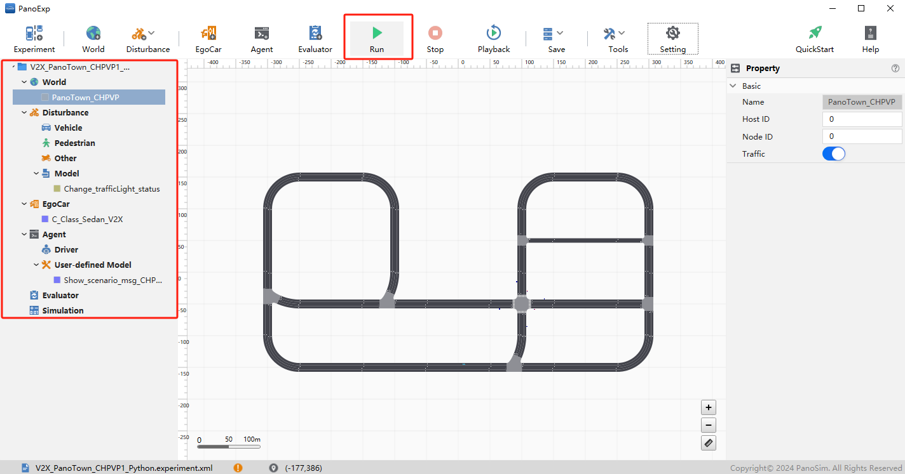

# PanoSim V2X CHPVP_Python_V2X：CHPVP Python Sample算法

## 1. 实例概述
### CHPVP: 协作式优先车辆通行（Cooperative High Priority Vehicle Passing）。本实例展示了如何通过控制交通灯状态来实现消防车在十字路口的快速通行。

## 2. 安装部署

### 2.1 下载[文件](./PanoSimDatabase)

### 2.2 查询本地对应目录

### 2.3 复制文件到本地对应目录

## 3. 运行实验

## 4. CHPVP Sample Python

### 4.1 Python 源代码
[%PanoSimDatabaseHome%/Plugin/Disturbance/Change_trafficLight_status.py](PanoSimDatabase/Plugin/Disturbance/Change_trafficLight_status.py)
[%PanoSimDatabaseHome%/Plugin/Agent/Show_scenario_msg_CHPVP1.py](PanoSimDatabase/Plugin/Agent/Show_scenario_msg_CHPVP1.py)

### 4.2 可视化运行

## 5. 引用
### [1] CSAE 157-2020 合作式智能运输系统 车用通信系统应用层及应用数据交互标准 第二阶段
