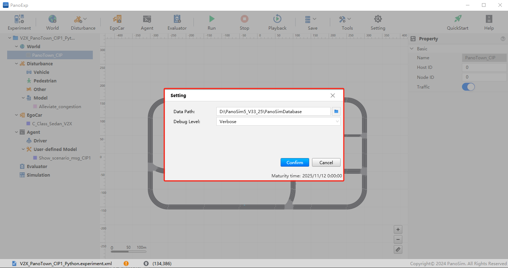
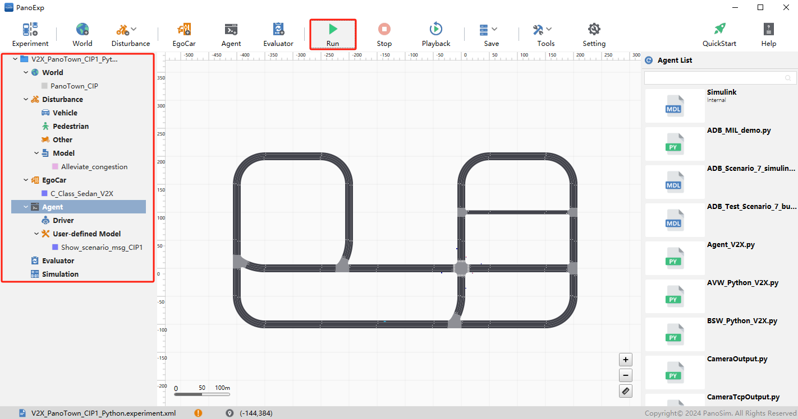

# PanoSim V2X CIP_Python_V2X：CIP Python Sample算法

## 1. 实例概述
### CIP: 协作式交叉口通行（Cooperative Intersection Passing）。本实例展示了如何通过控制交通灯状态，实现部分慢速车流在十字路口的安全通行，避免交通拥堵。

## 2. 安装部署

### 2.1 下载[文件](./PanoSimDatabase)

### 2.2 查询本地对应目录

### 2.3 复制文件到本地对应目录

## 3. 运行实验

## 4. CIP Sample Python

### 4.1 Python 源代码
[%PanoSimDatabaseHome%/Plugin/Disturbance/Alleviate_congestion.py](PanoSimDatabase/Plugin/Disturbance/Alleviate_congestion.py)
[%PanoSimDatabaseHome%/Plugin/Agent/Show_scenario_msg_CIP1.py](PanoSimDatabase/Plugin/Agent/Show_scenario_msg_CIP1.py)

### 4.2 可视化运行

## 5. 引用
### [1] CSAE 157-2020 合作式智能运输系统 车用通信系统应用层及应用数据交互标准 第二阶段
