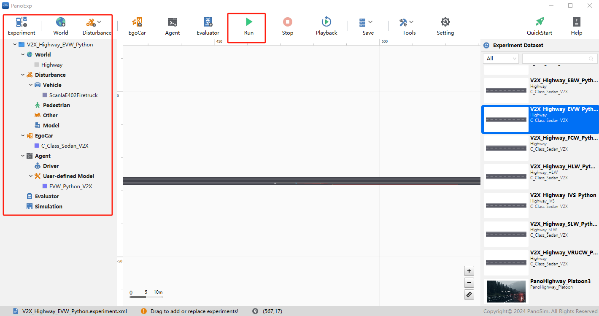

# PanoSim V2X EVW_Python_V2X：EVW Python Sample算法

## 1. 安装部署

### 1.1 下载[文件](./PanoSimDatabase)

### 1.2 查询本地对应目录

### 1.3 复制文件到本地对应目录

## 2. 运行实验

## 3. EVW Sample Python

### 3.1 Python 源代码
[%PanoSimDatabaseHome%/Plugin/Agent/EVW_Python_V2X.py](PanoSimDatabase/Plugin/Agent/EVW_Python_V2X.py)

### 3.2 可视化运行

## 4. 引用
### [1] CSAE 53-2020 合作式智能运输系统 车用通信系统 应用层及应用数据交互标准（第一阶段）
